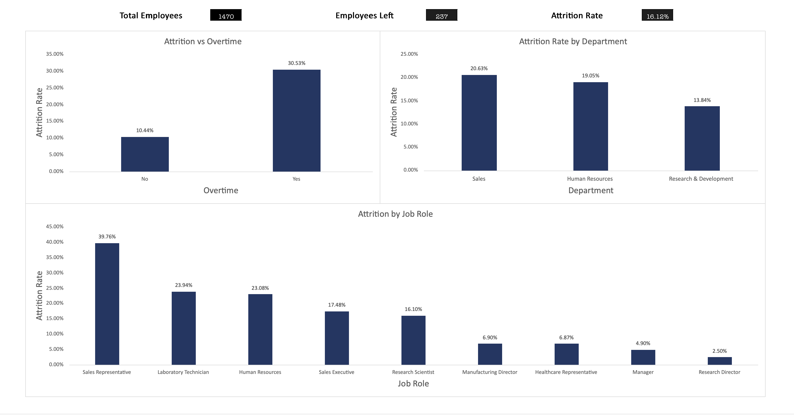

# HR Attrition Dashboard (Excel)

## Overview
I built this Excel dashboard to analyze employee attrition across departments, job roles, and overtime.

The goal was to turn raw HR data into clear insights that help understand why employees leave.

## Key Metrics
- Total Employees: 1470
- Employees Left: 237
- Attrition Rate: 16.12%

## Insights
- Overtime employees have a much higher attrition rate (30.53%) vs non-overtime (10.44%)
- Sales has the highest attrition rate (20.63%)
- Research & Development has the lowest attrition rate (13.84%)
- Sales Representatives have the highest attrition (39.76%)
-
## Business Impact
This dashboard helps HR teams identify high-risk areas of employee turnover and make data-driven decisions to improve retention.

## Tools Used
- Microsoft Excel
- Pivot Tables
- Data Visualization

## Files
- Excel Dashboard
- Dashboard Screenshot

## Author
Jesse Morales
